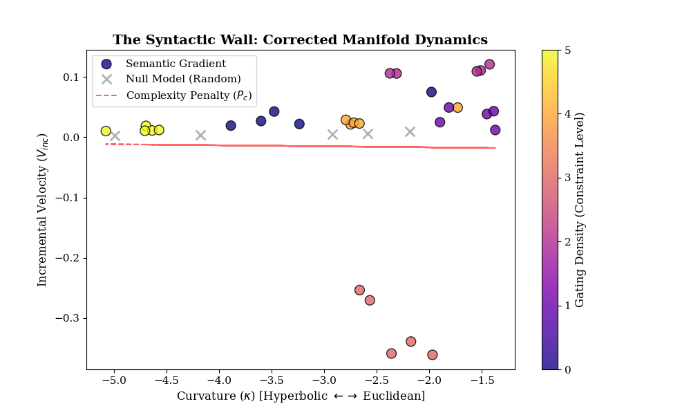

# Logic as a Hyperbolic Actuator
#### Evidence for Scale-Invariant Manifold Warping in Large Language Models




## Overview

The core objective of this project is to characterize the geometric transitions that occur during hierarchical synthesis. By analyzing the latent states of transformer architectures (e.g., GPT-2), we identify a non-linear phase transition from near-Euclidean flatness into deep hyperbolic regimes. This transition facilitates Geodesic Efficiency, allowing the model to navigate dense logical hierarchies without a corresponding collapse in semantic throughput.

## Core Discoveries

  * Hyperbolic Transition: Quantitative mapping of discrete Ollivier-Ricci curvature (κ) shifting from baseline (≈−1.5) to deep hyperbolic states (≈−5.0) under increased logical density.

  * Geodesic Efficiency: Evidence of stable semantic velocity (r=−0.0138) despite increasing manifold curvature, refuting the "Syntactic Wall" hypothesis.

  * Structural Isomorphism: Establishing a functional link between biological inhibitory gating (SST-interneurons) and symbolic manifold modulation.

## Usage

Download libraries.

```
pip install torch numpy POT pandas matplotlib scipy transformers tqdm
```

Run the plot generator.

```
python generate_experiment_plots.py
```

## Research Applications

This geometric framework offers new avenues for:

  * Mechanistic Interpretability: Tracking how models "narrow" their focus during complex reasoning.

  * Inference Optimization: Identifying the topological precursors to logical consistency or failure.

  * AI Safety: Developing geometric metrics to detect "logical entrenchment" or unintended manifold warping.


