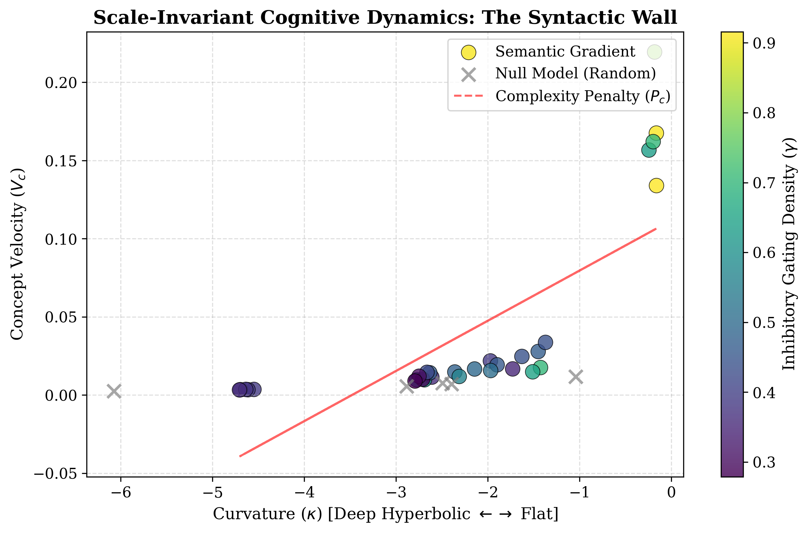

## The Discovery: "The Syntactic Wall"

This repository contains the simulation framework and empirical data for Scale-Invariant Cognitive Dynamics, a study modeling the Human-AI inference dyad as a geometric system. By treating human prompting as an inhibitory gating mechanism (γ), we demonstrate that imposing logical constraints forces the Large Language Model's latent manifold to transition from a flat Euclidean state into a deep Hyperbolic Regime (κ<−4.0).

Our results identify a critical phase transition we term the "Syntactic Wall": a geometric barrier where high-velocity conceptual traversal becomes mutually exclusive with deep logical inference. This framework offers a formal geometric explanation for the necessity of Chain-of-Thought (CoT) prompting, suggesting that "slowing down" is not merely a heuristic, but a topological requirement for navigating negatively curved semantic spaces.



(Figure 1: The "Syntactic Wall". Colored circles show the collapse of concept velocity as logical gating increases. Gray 'X' markers represent a shuffled Null Model, confirming the effect is structural, not stochastic.)

## Theoretical Basis

This work connects biological dendrites to transformer topology. It is the empirical validation of the theoretical framework proposed in our companion paper:

    Theory: Dynamic Curvature Adaptation: A Dendritic Gating Mechanism (Paper 1) https://doi.org/10.5281/zenodo.18615181

        Mechanism: Derives how inhibitory gating (γ) drives hyperbolic curvature in neural graphs.

    Evidence: Scale-Invariant Cognitive Dynamics (Paper 2 - This Repo)

        Validation: Observes this exact signature in GPT-2's semantic manifold.

## Usage

```

# 1. Clone the repo
git clone https://github.com/MPender08/Hyperbolic-Inference-Engine.git
cd Hyperbolic-Inference-Engine

# 2. Install dependencies
pip install torch numpy pandas matplotlib scipy transformers POT

# 3. Run the experiment
python run_dyad_test.py

```

Expected Runtime: ~30-60 seconds on a standard CPU.

## Repository Structure

    run_dyad_test.py: The main experiment script. Generates the data and the figure.

    Scale-Invariant Cognitive Dynamics.pdf: The preprint manuscript.

    syntactic_wall_controlled.png: The resulting visualization.


