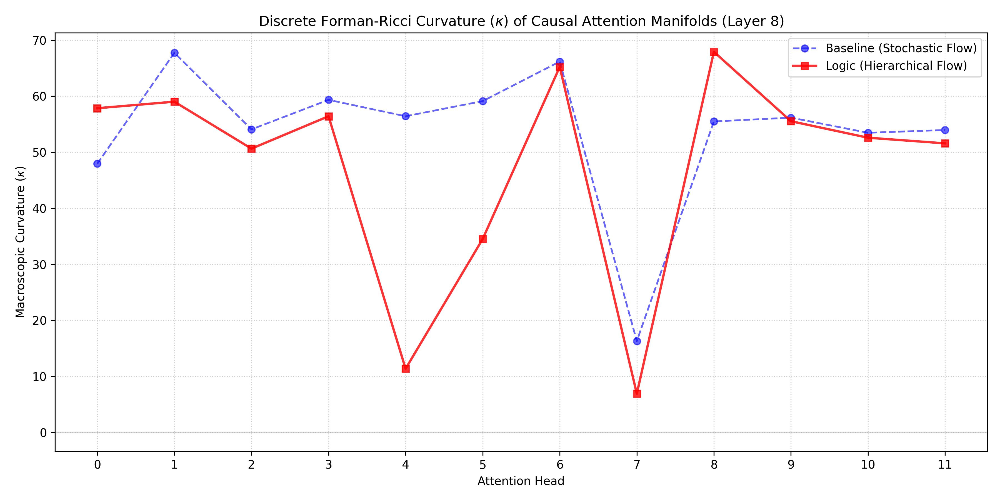
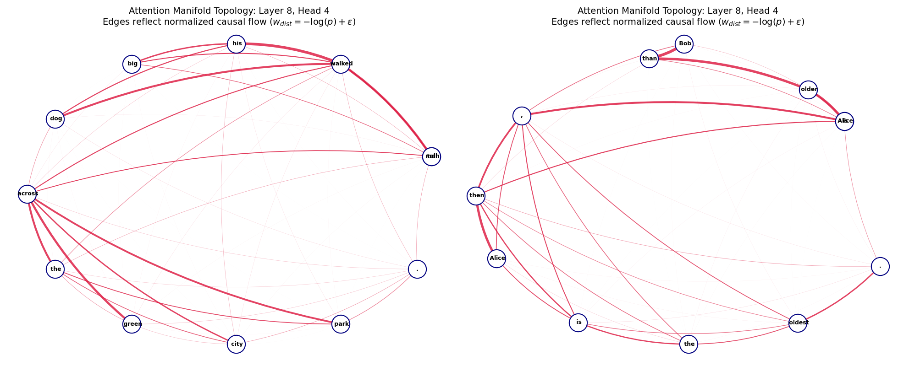

# Logic as a Hyperbolic Actuator: Evidence for VIP-Mediated Phase Transitions in Transformer Attention Manifolds

This repository contains the official code implementation for the paper "Logic as a Hyperbolic Actuator." By evaluating the internal attention matrices of the GPT-2 transformer architecture as strictly directed causal graphs, this codebase provides empirical evidence for the Curvature Adaptation Hypothesis (CAH). It demonstrates that logical reasoning in LLMs is not simply advanced semantic pattern matching, but a computationally expensive macroscopic geometric phase transition.

Under default generative conditions, the model idles in a dense, highly suppressed Euclidean topology (κ≈50−70). The human operator’s logical prompt functions as a biological VIP interneuron override, disinhibiting the network and forcing specific induction heads to hollow out their geometry into sparse, low-latency hyperbolic tree structures (Δκ≈−45) to solve multi-hop constraints.

[https://doi.org/10.5281/zenodo.18627785](https://doi.org/10.5281/zenodo.18627785)


Figure 1: VIP-Mediated Phase Transitions in the Attention Manifold. Macroscopic discrete Forman-Ricci curvature (κ) measured across Layer 8 causal attention graphs. Under the unconstrained Euclidean baseline (blue dashed line), the network prioritizes dense, diffuse stochastic dispersion (κ ≈ 50 − 70). The application of a logical constraint (red solid line) triggers a violent phase transition in specific induction heads (4 and 5), which shed edges and collapse into sparse, hierarchical topologies (∆κ ≈ −45) to act as VIP overrides. Head 7 remains the foundational structural sink.


Figure 2: Topological Visualization of the VIP Override (Layer 8, Head 4) Causal attention graphs generated via Kamada-Kawai layout, minimizing structural distances (wdist = − log(p) + ϵ). (Left) Under the unconstrained Euclidean baseline, the semantic manifold maintains a dense, diffuse web of interconnected attention pathways (corresponding to highly positive curvature, κ ≈ 56). (Right) Under logical constraint, the head sheds its stochastic pathways, hollowing out the center of the manifold to form a sparse, highly-directed structural tree(κ ≈ 11). This geometric rewiring optimizes information transport across logical operators.

## Repository Contents

* `hyperbolic_scanner.py`: The primary experimental script. It evaluates the macroscopic discrete Forman-Ricci curvature of the attention manifold across Layer 8.

* `hyperbolic_visualizer.py`: Generates a physical 2D projection of the attention manifold for specific heads using the Kamada-Kawai force-directed layout.

## Methodology

To ensure absolute mathematical and topological integrity, the scripts enforce the following strict constraints:

* Strictly Length-Matched Prompts: Both the baseline and logic prompts evaluate exactly 13 tokens after BPE tokenization to eliminate sequence-length confounders.

* Sink Eradication: Index 0 is explicitly sliced from the attention matrices to prevent the "Star Graph" artifact caused by attention sink dumping.

* True DAG Integrity: The graph is built as a strictly Directed Acyclic Graph (DAG). Self-loops are mathematically banned (j<i), and information flows strictly forward through time (Past → Present).

* Distance Inversion: Attention probabilities are converted to geometric structural distances using wdist​=−log(p)+ϵ. A microscopic epsilon (1e-5) prevents zero-distance math crashes in the Forman-Ricci solver when attention becomes 100% deterministic.

## Installation & Usage

**Environment Setup:**
```bash
pip install torch numpy networkx matplotlib transformers GraphRicciCurvature
```
Run the curvature scanner to map the structural phase transitions across all heads in Layer 8:
```bash
python hyperbolic_scanner.py
```
**Note on Math Solver Stability:** 
Depending on your hardware and NumPy backend, the `GraphRicciCurvature` solver can sometimes hang or crash due to OpenMP/MKL thread contention (multiple CPU cores fighting over the same matrix calculations). If you experience infinite hanging during the "Processing" steps, restrict the math libraries to a single thread before running:
* **Windows (PowerShell):**
```bash
$env:OMP_NUM_THREADS="1"; $env:MKL_NUM_THREADS="1"; python hyperbolic_scanner.py
```
* **Mac/Linux:**
```bash
OMP_NUM_THREADS=1 MKL_NUM_THREADS=1 python hyperbolic_scanner.py
```

Run the visualizer to physically see the manifold hollow itself out to build sparse routing corridors:
```bash
python hyperbolic_visualizer.py
```
Note: To switch between visualizing the dense Euclidean baseline and the sparse Hyperbolic logic state, comment/uncomment the desired `PROMPT` string at the top of the script.


